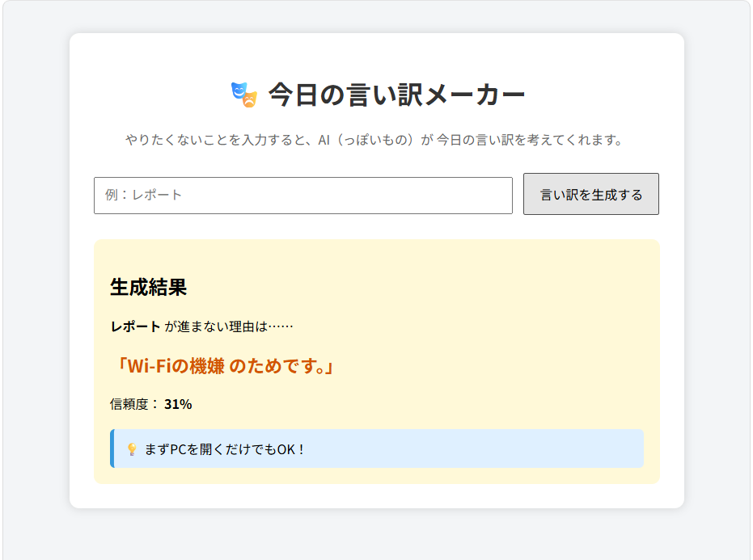

# 🎭 今日の言い訳メーカー

## 概要

「今日の言い訳メーカー」は、やりたくないことを入力すると、その理由をランダムに生成してくれるジョークアプリです。

例えば「レポート」「勉強」「掃除」などを入力すると、「宇宙線の影響」「CPUの熱暴走」「Wi-Fiの機嫌」など、思わず笑ってしまうような言い訳を生成します。また、最後には「5分だけ始めよう！」などの励ましのメッセージも表示されます。

Dockerコンテナ上でFlaskアプリケーションを実行し、ホストPCのブラウザからアクセスして利用します。

---

## システムの特徴

本システムは以下の3つの要素から構成されています。

- **入力**
  - ユーザーが「やりたくないこと」を入力します。
- **処理**
  - Pythonがランダムに言い訳・信頼度・励ましのメッセージを生成します。
- **出力**
  - 生成された結果をブラウザ上に表示します。

---

## 用途

本アプリは娯楽・学習用として作成したWebアプリケーションです。

以下のような用途を想定しています。

- 勉強や課題の息抜き
- DockerとFlaskを用いたWebアプリケーション開発の学習
- Webアプリケーションの「入力・処理・出力」の流れを理解するためのサンプル

---

## 開発環境

- Python 3.12
- Flask
- Docker
- Docker Compose

---

## ディレクトリ構成

```text
fun-excuse-app/
│
├── app.py
├── Dockerfile
├── docker-compose.yml
├── requirements.txt
│
├── templates/
│   └── index.html
│
├── static/
│   └── style.css
│
├── screenshot.png
│
└── README.md
```

---

## Dockerコンテナの起動方法

### 1. プロジェクトへ移動

```bash
cd fun-excuse-app
```

### 2. Dockerコンテナをビルド・起動

```bash
docker compose up --build
```

起動後、以下のようなメッセージが表示されれば成功です。

```text
Running on http://127.0.0.1:5000
```

### 3. ブラウザでアクセス

以下のURLをブラウザで開きます。

```text
http://localhost:5000
```

---

## コンテナの停止方法

ターミナルで

```text
Ctrl + C
```

を押して停止します。

コンテナを削除する場合は

```bash
docker compose down
```

を実行してください。

---

## 使い方

1. ブラウザからアプリを開く
2. 「やりたくないこと」を入力する
3. **「言い訳を生成する」** ボタンを押す
4. ランダムな言い訳・信頼度・励ましのメッセージが表示される

---

## 動作画面



---

## 実行例

### 入力

```
レポート
```

### 出力例

```
レポートが進まない理由は……

「Wi-Fiの機嫌のためです。」

信頼度：31%

💡 まずPCを開くだけでもOK！
```

※言い訳や信頼度はランダムに生成されるため、実行するたびに異なります。

---

## システム構成

```
ブラウザ
      │
      │ HTTP
      ▼
Dockerコンテナ
      │
      ▼
Flask（Python）
      │
      ▼
ランダムな言い訳生成
```

---

## 使用ライブラリ

- Flask

---

## 作者

（氏名を記入）
